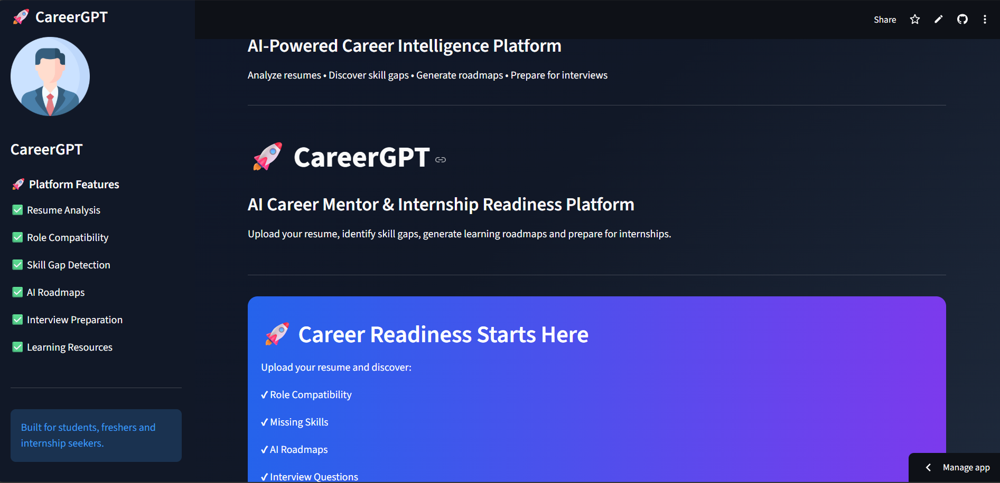
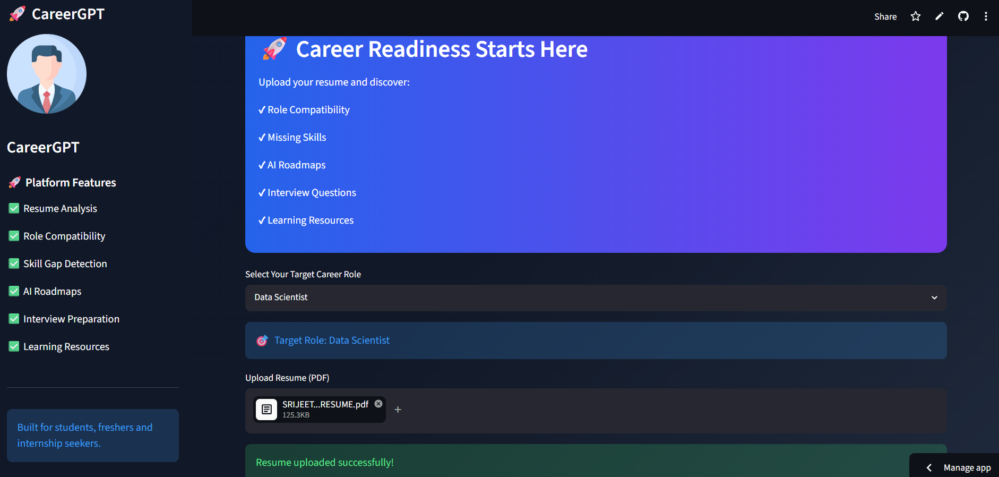
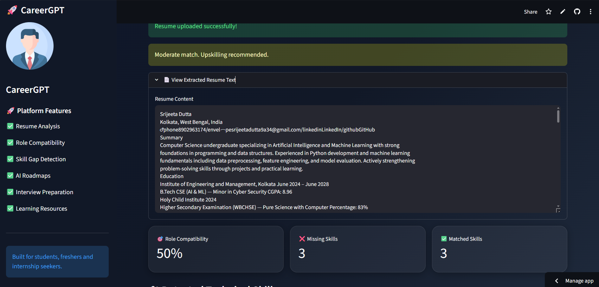
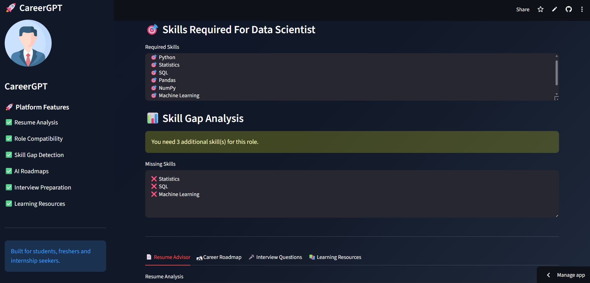
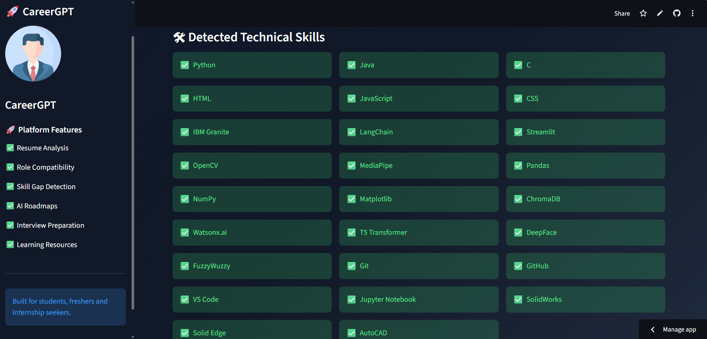
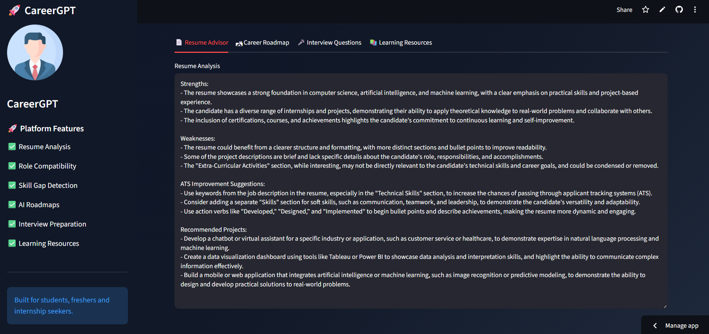
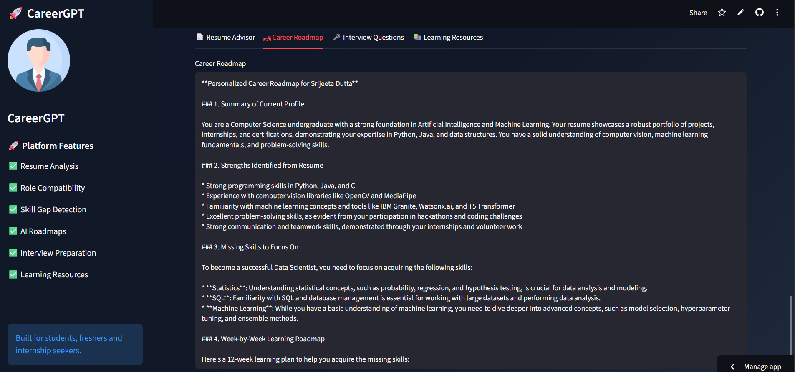
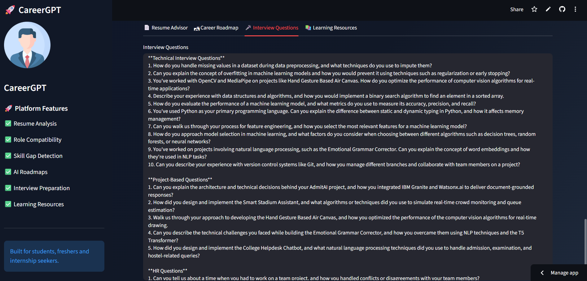
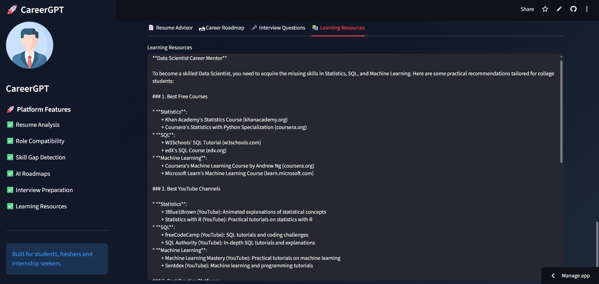

# 🚀 CareerGPT

### AI-Powered Career Guidance & Internship Readiness Platform

CareerGPT is an intelligent career mentoring platform that analyzes resumes, identifies skill gaps, evaluates role compatibility, and generates personalized career guidance using Large Language Models (LLMs).

The platform helps students and aspiring professionals understand their readiness for industry roles and provides actionable recommendations to improve employability.

---

## 🌐 Live Demo

**Deployed Application:**
https://careergpt-ai-mentor-mnwvyxf99bhfsm3hp93jrm.streamlit.app/

---

## ✨ Key Features

### 📄 Resume Parsing

* Upload resumes in PDF format
* Automatic text extraction and processing

### 🧠 AI Skill Extraction

* Extracts technical skills from resumes using LLMs
* Identifies technologies, frameworks, tools, and programming languages

### 🎯 Role Compatibility Analysis

* Evaluates resume suitability for selected career roles
* Generates a compatibility score based on skill matching

### 🔍 Skill Gap Detection

* Compares candidate skills with industry-required skills
* Highlights missing competencies

### 📋 AI Resume Advisor

* Reviews resumes and provides improvement suggestions
* Helps improve ATS-friendliness and profile strength

### 🛣 Personalized Career Roadmap

* Generates step-by-step learning paths
* Recommends skills to acquire for target roles

### 🎤 Interview Preparation

* Generates technical and HR interview questions
* Tailored according to selected role and candidate profile

### 📚 Learning Resource Recommendation

* Suggests courses, certifications, YouTube channels, and practice platforms
* Personalized according to identified skill gaps

---

## 💼 Supported Career Roles

* AI Engineer
* Machine Learning Engineer
* Data Scientist
* Frontend Developer
* Backend Developer
* Cybersecurity Analyst

---

## 🏗️ System Workflow

1. Upload Resume (PDF)
2. Extract Resume Content
3. Identify Technical Skills
4. Compare Skills with Target Role
5. Calculate Role Compatibility
6. Detect Missing Skills
7. Generate AI Recommendations
8. Create Learning Roadmap
9. Generate Interview Questions
10. Recommend Learning Resources

---

## 🛠️ Tech Stack

### Frontend

* Streamlit

### Backend

* Python

### AI & LLM

* Groq API
* Llama 3.3 70B Versatile

### Data Processing

* Pandas
* PyPDF2

### Environment Management

* Python Dotenv

### Version Control

* Git
* GitHub

---

## 📸 Application Screenshots

### Homepage



### Dashboard



### Role Compatibility Analysis



### Skill Gap Analysis



### Detected Skills



### Resume Advisor



### Career Roadmap



### Interview Questions



### Learning Resources



---

## 📂 Project Structure

CareerGPT/

├── app.py

├── assets/

├── data/

│   ├── roles.csv

│   └── skills.csv

├── modules/

│   ├── ai_skill_extractor.py

│   ├── interview_generator.py

│   ├── llm_service.py

│   ├── pdf_parser.py

│   ├── resource_generator.py

│   ├── resume_advisor.py

│   ├── roadmap_generator.py

│   ├── role_compatibility.py

│   └── skill_gap.py

├── requirements.txt

├── .gitignore

└── README.md

---

## ⚙️ Installation

### Clone Repository

```bash
git clone https://github.com/Srijeeta977/CareerGPT-AI-Mentor.git

cd CareerGPT-AI-Mentor
```

### Create Virtual Environment

```bash
python -m venv venv
```

### Activate Environment

Windows:

```bash
venv\Scripts\activate
```

### Install Dependencies

```bash
pip install -r requirements.txt
```

### Configure Environment Variables

Create a `.env` file:

```env
GROQ_API_KEY=your_api_key_here
```

### Run Application

```bash
streamlit run app.py
```

---

## ⚠️ Groq API Note

This application uses the Groq API for AI-powered features.

Free-tier Groq accounts may occasionally experience:

* Token limits
* Rate limits
* Temporary service delays

If a limit is reached, please wait for the cooldown period and try again.

---

## 🤝 Contributing

Contributions, feature suggestions, and improvements are welcome.

1. Fork the repository
2. Create a feature branch
3. Commit your changes
4. Push the branch
5. Open a Pull Request

---

## 📜 License

This project is licensed under the MIT License.

---

## 👩‍💻 Author

### Srijeeta Dutta

B.Tech in Artificial Intelligence & Machine Learning

Passionate about AI, Machine Learning, Career Technology, and Intelligent Software Systems.

GitHub:
https://github.com/Srijeeta977

LinkedIn:
(Add your LinkedIn profile link here)

---

⭐ If you found this project useful, consider giving the repository a star.
